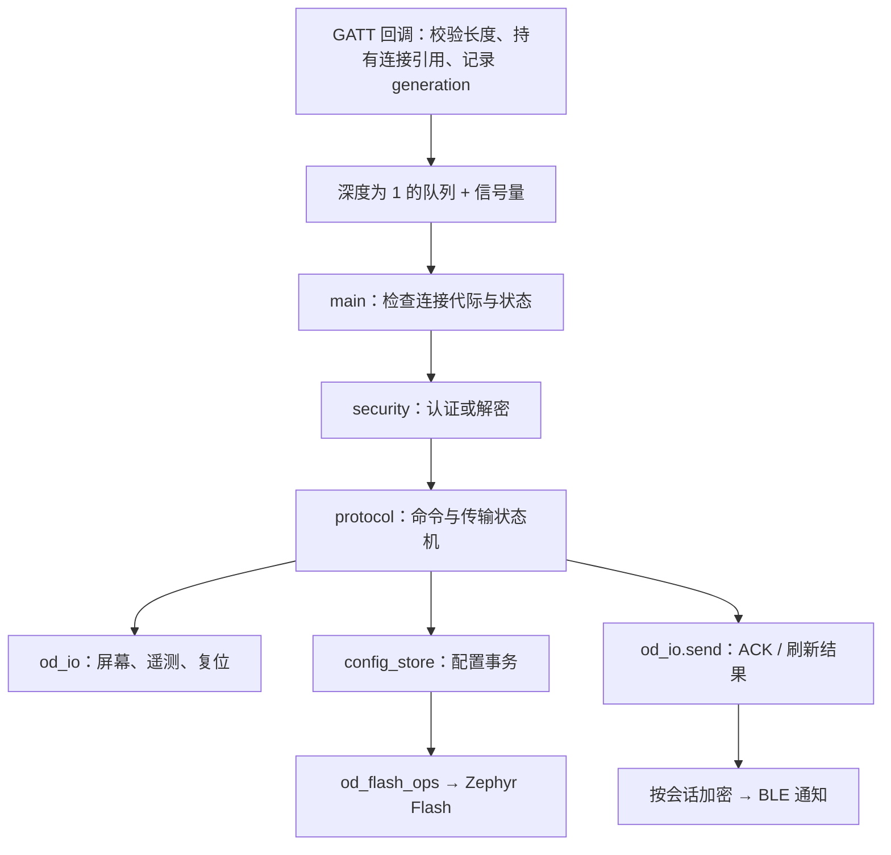

# 架构与资源模型

[文档导航](README.md)

本固件的核心约束是 16 KiB RAM。它以一个主业务循环串行处理请求，数据到达后流式写入屏幕或非活动 Flash 页，避免整帧图像、整份待提交配置和多个在途命令同时常驻 RAM。

## 一次请求如何执行

图中业务路径在主循环执行；认证握手由 security 直接生成响应。队列满时断开连接，因为 Write Without Response 无法可靠地向客户端返回 ATT 错误；静默丢掉图像字节会使后续状态失真。连接引用确保命令处理期间对象仍存在，generation 确保重连后不会继续执行旧连接的命令。

BLE 回调只入队，屏幕 BUSY 等待、解压和 Flash 事务留在主循环。通知遇到资源暂缺会有界重试，连接失效或发送失败进入清理路径。断连、传输超时和重认证会取消相关事务。

## 模块边界

| 模块 | 职责 | 修改时配套检查 |
| --- | --- | --- |
| [main.c](../src/main.c) | BLE 身份、队列、认证分发、通知、截止时间和恢复 | 连接代际、引用释放、活动计时、通知失败 |
| [protocol.c](../src/protocol.c) | 命令与 PIPE 状态机、解压、长度和 etag 校验 | `tests/test_protocol.c`；线上响应顺序 |
| [config_store.c](../src/config_store.c) | 容器校验、双槽提交、运行时字段查询 | `tests/test_storage.c`；旧配置保留与重启恢复 |
| [storage.c](../src/storage.c) | Zephyr Flash 适配 | devicetree 分区、擦除页与写入对齐 |
| [security.c](../src/security.c) | CMAC/CCM、会话、计数器与重放 | `tests/test_security.py`；加密路径栈空间 |
| [epd.c](../src/epd.c) | 软件 SPI、全刷/局刷、关电与唤醒 | `tests/test_epd.c`；电气时序与实际画质 |
| [telemetry.c](../src/telemetry.c) | 温度和 VDD 采样、MSD 编码 | `tests/test_telemetry.c`；失败保留旧快照 |
| [third_party/uzlib](../third_party/uzlib/) | 有界窗口的流式 zlib 解码 | 压缩结束、Adler32、输出总长度 |

`struct od_io` 把协议与设备操作分开，`struct od_flash_ops` 把配置事务与物理 Flash 分开。主机测试替换这两处边界；面板测试则编译真实驱动，以虚拟 GPIO/时钟解码输出。新增功能优先保持这些可测边界。

## 硬件与地址空间

| 信号 | GPIO | 含义 |
| --- | --- | --- |
| MOSI / SDA | P0.30 | MSB first |
| SCK | P0.00 | 软件 SPI mode 0 |
| CS | P0.01 | 低有效 |
| DC | P0.02 | 低命令、高数据 |
| RESET | P0.03 | 低有效 |
| BUSY | P0.04 | 物理低为忙、高为就绪；无内部上拉 |
| BS | P0.05 | 低，四线 SPI |

引脚和分区定义在 [devicetree](../boards/greentags/lt213a/lt213a_nrf51822.dts)。低频时钟使用校准的内部 RC；P0.00 已用于 SCK，不能配置为外部低频晶振。

| 区域 | 范围 | 用途 |
| --- | --- | --- |
| 应用 Flash | `0x00000..0x1F7FF` | 向量表从 0 开始，无 SoftDevice/bootloader |
| 配置槽 0 | `0x1F800..0x1FBFF` | 1 KiB 擦除页 |
| 配置槽 1 | `0x1FC00..0x1FFFF` | 1 KiB 擦除页 |
| RAM | `0x20000000..0x20003FFF` | 静态数据、线程栈、BLE 池，无动态堆 |

程序不能借用末尾配置页。图片全帧虽只有 2,756 B，也足以突破现有 RAM 预算，因此原始数据直接写屏，zlib 使用 512 B 历史窗口和小块输出。配置数据直接进入非活动槽，提交前仍读旧槽。

## 并发、截止时间与维护约束

主循环等待命令、连接变化或最近截止时间，Zephyr 无线与时钟任务独立运行。软件 SPI 不关闭中断；因此测量到的时钟间隔可能被无线活动拉长，不能把最小半周期当作恒定总吞吐。

改变缓冲、线程栈、队列、日志或编译选项，都需要重新构建并检查资源。静态布局通过不代表调用栈足够，特别是 LTO 与加密临时对象会改变峰值。详见[性能与内存](performance.md)。

板级可选硬件能力由实现与配置共同约束。增加一个 TLV 或返回成功 ACK 之前，需要明确谁消费该字段、何时生效、失败后如何恢复；现有范围见[协议与配置](protocol.md)。
